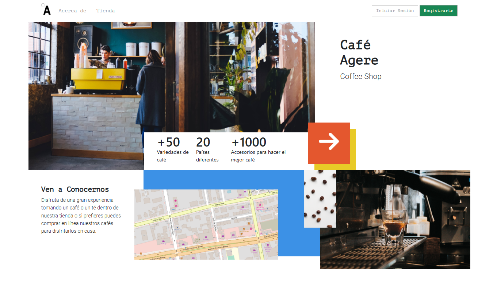

# **MOCKUP OF A COFFEE SHOP HOME**

## **Description**
This page serves as an initial prototype for the home of a coffee shop eCommerce, designed to adapt fluidly to different devices and follow a specific style guide. It features a responsive design and manages element overlapping effectively.

## **Technologies Used**
HTML5, CSS/SCSS, SASS, BEM Methodology

## **Features**
- Separates the visual logic of the project using partials, `@import` directives, and a manifest.
- Uses semantic tags for the HTML structure.
- Creates semantic classes using the BEM methodology.
- Uses Sass variables to reuse CSS/SCSS code efficiently.

## **Screenshots**
<p align="center">
  
</p>

## **Installation**
1. Clone the repository:
   ```bash
   git clone https://github.com/yadicep/mockup_coffee_shop.git
